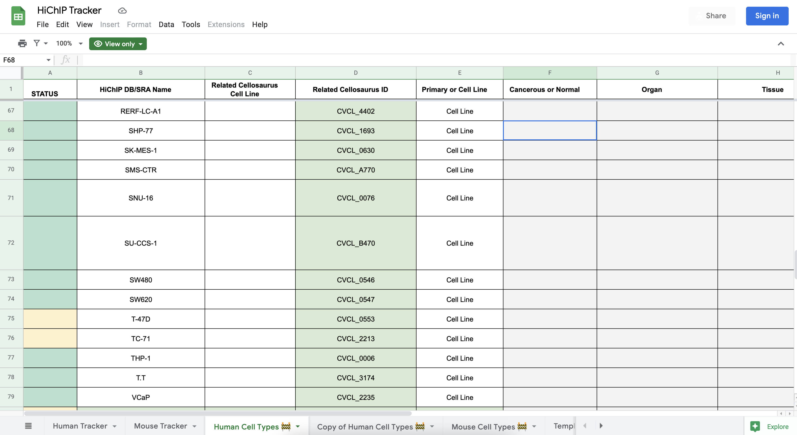

# Cell Type Resources
The main point of this repository is to create cell type information at the Ay Lab finds reliable and easily usable from a programming/analysis standpoint. This initially started from the HiChIP website project but we wanted to keep it general for use across all projects.

For this first iteration we are parsing individual pages from Cellosaurus but eventually we want to download the whole Cellosaurus catalog which is available through: https://ftp.expasy.org/databases/cellosaurus/. From this FTP link there are three files that can be parsed: 1) tbd, 2) tbd, 3) tbd. As soon as we find good parsers we will decide on which file to use. 

## Getting started

To get cellosaursu meta data for your favorite cell lines please:
1. Go to [HiChIP Tracker Google Sheet](https://docs.google.com/spreadsheets/d/1myw--D1_jMa3UFEUPyLy5C3MnbfcJzLIIJEoCS_3X4k/edit#gid=1154000703)
2. Click the "Human Cell Types" tab
3. Select "Related Cellosaurus ID" column and copy the content to a file named "accessions.txt"

4. You don't have to remove the empty rows in accessions.txt, but if you wish, you can run `sed -i '/^$/d' accessions.txt`
5. Go to `cell-type-resources` directory and run `bash parsing_cellosaurus_samples.sh`

    The code will download Cellosaurus sample metadata files that match the CVCL_xxxx accession IDs you provided, filter the sample metadata for only necessary rows, transpose these rows to a table, then concate it with other samples.

6. Example output

<describe the table header and values including what missing data looks like>

## Visuals
Depending on what you are making, it can be a good idea to include screenshots or even a video (you'll frequently see GIFs rather than actual videos). Tools like ttygif can help, but check out Asciinema for a more sophisticated method.

## Installation
Within a particular ecosystem, there may be a common way of installing things, such as using Yarn, NuGet, or Homebrew. However, consider the possibility that whoever is reading your README is a novice and would like more guidance. Listing specific steps helps remove ambiguity and gets people to using your project as quickly as possible. If it only runs in a specific context like a particular programming language version or operating system or has dependencies that have to be installed manually, also add a Requirements subsection.

## Usage
Use examples liberally, and show the expected output if you can. It's helpful to have inline the smallest example of usage that you can demonstrate, while providing links to more sophisticated examples if they are too long to reasonably include in the README.

## Support
Tell people where they can go to for help. It can be any combination of an issue tracker, a chat room, an email address, etc.

## Roadmap
If you have ideas for releases in the future, it is a good idea to list them in the README.

## Contributing
State if you are open to contributions and what your requirements are for accepting them.

For people who want to make changes to your project, it's helpful to have some documentation on how to get started. Perhaps there is a script that they should run or some environment variables that they need to set. Make these steps explicit. These instructions could also be useful to your future self.

You can also document commands to lint the code or run tests. These steps help to ensure high code quality and reduce the likelihood that the changes inadvertently break something. Having instructions for running tests is especially helpful if it requires external setup, such as starting a Selenium server for testing in a browser.

## Authors and acknowledgment
Show your appreciation to those who have contributed to the project.

## License
For open source projects, say how it is licensed.

## Project status
If you have run out of energy or time for your project, put a note at the top of the README saying that development has slowed down or stopped completely. Someone may choose to fork your project or volunteer to step in as a maintainer or owner, allowing your project to keep going. You can also make an explicit request for maintainers.
