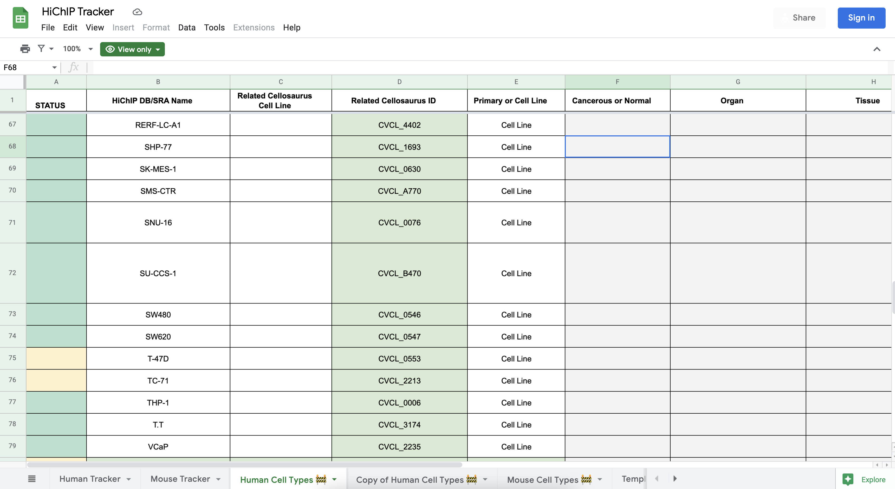
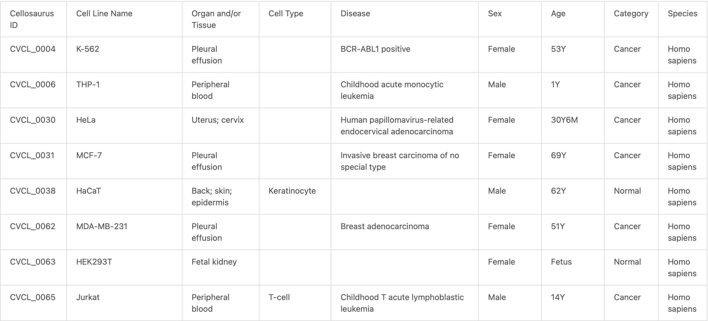

# GEO-Resources
This repository was made in order to handle a variety of queries we make to the
GEO as part of the Loop Catalog. In particular, we have two modules:
1) Query the GEO database datasets containing HiChIP data + located their raw data.
2) Given a list of GSMs, determine metadata for each sample including organ, etc.

## Locating HiChIP Datasets
Briefly, this module uses queries to the different NCBI database using the
NCBI API directly as well as pysradb and other packages when necessary.

### Code & Execution:

The scripts are located within: `cell-type-resources/scripts/geo_queries/`

 

**1) query_geo.ipynb**

Synopsis: Queries GEO DataSets (https://www.ncbi.nlm.nih.gov/gds)

Output: results/geo/geo.query.{date}.xlsx

 

**2) slurm/link_gse_to_sra.{date}.sh & linking_gse_to_sra.py**

Synopsis: Queries the SRA database for a given GSE ID and save a table of samples.

Input: results/sra/geo.samplesheet.{date}.txt # samplesheet where each line contains a GSE ID

Output: results/sra/individual_gse/{gse_id}.meta.major_columns.renamed.tsv

 

**3) merge_sra_queries.sh**

Synopsis: Merges all results from step (2)

Input: Individual GSE files from part (2)

Output: results/sra/combined.meta.major_columns.renamed.tsv

## Assigning Sample Metadata from Biosample-based Information
Quickly, this module creates metadata that is reliable and easy to use for the
Loop Catalog website but is programmed in a generalized way to be used by anyone.

The scripts/files are located within: `cell-type-resources/scripts/geo_celltypes/`

**Code) gsm_to_celltype_metadata.ipynb**
Synopsis: Takes in a list of GSM IDs then queries the Entrez Biosamples database
looking for all possible notes that, in conjunction with the metadata dictionary
(see detail below), will define different metadata such as organ, etc.

**Helper File1) gsm_to_celltype_metadata.ipynb**
Synopsis: JSON file that contains a dictionary for assiging a certain metadata term
to a given sample.

<!--
## Assigning Additional Sample Metadata for Cell Lines

## Getting started

To get cellosaurus meta data for your favorite cell lines please:
1. Go to [HiChIP Tracker Google Sheet](https://docs.google.com/spreadsheets/d/1myw--D1_jMa3UFEUPyLy5C3MnbfcJzLIIJEoCS_3X4k/edit#gid=1154000703)
2. Click the "Human Cell Types" tab
3. Select "Related Cellosaurus ID" column and copy the content to a file named "accessions.txt"

4. You don't have to remove the empty rows in accessions.txt, but if you wish, you can run `sed -i '/^$/d' accessions.txt`
5. Go to `cell-type-resources` directory and run `bash parsing_cellosaurus_samples.sh`

    The code will download Cellosaurus sample metadata files that match the CVCL_xxxx accession IDs you provided, filter the sample metadata for only necessary rows, transpose these rows to a table, then concate it with other samples. Lastly, this table will be sorted.

6. Example output. This is what celltype.csv can look like:

     1\) Cellosaurus ID column has various values.

     2\) Cell Line Name column has various values.

     3\) Organ and/or Tissue column can have general sampling site and specific site separated by a semicolon, like "Uterus; cervix." However, there're some cell lines' metadata that doesn't have sampling site information, regardless of category.
     
     4\) Cell Type column has various values and most are empty. Only some cell lines' metadata have cell type, like "Back; skin; epidermis. Cell type=Keratinocyte." 
     
     5\) Disease column has disease name from [NCI Thesaurus](https://www.ebi.ac.uk/ols/ontologies/ncit). If the cell line is non-cancerous, then the value is empty.

     6\) Sex column has either "Male", "Female", or "Sex unspecified" value.

     7\) Age column has various values.

     8\) Category column has various values, including "Cancer cell line" and non-cancerous categories like "Transformed cell line".

     9\) Species column has various values. This example has all human cell lines, so the column only has "Homo sapiens" value.
-->
